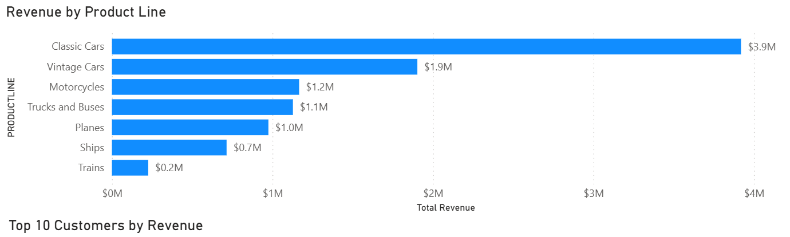
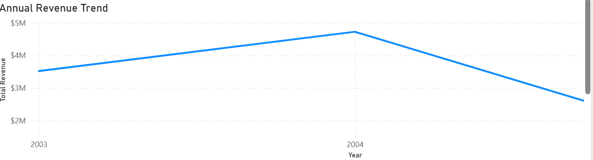
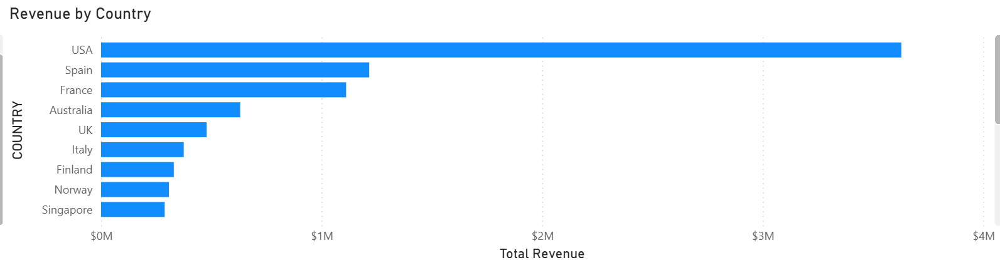
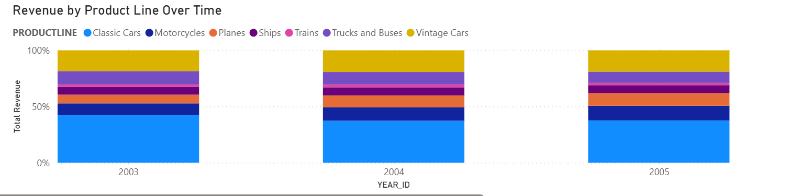

# Sales Performance & Customer Revenue Analysis

## Objective

The goal of this project was to analyze sales transaction data to identify revenue trends, customer behavior, product performance, and geographic patterns in order to support data-driven business decisions.

---

## Dataset

The dataset contains sales transaction records including:

* Product details (product line, product code)
* Customer information
* Order details
* Sales revenue
* Territory and country data
* Deal size classification

---

## Tools Used

* SQL
* Power BI

---

## Project Structure

* `sales_cleaning.sql` - Data cleaning and validation
* `sales_analysis.sql` - Exploratory data analysis and business insights
* `sales_performance_dashboard.pbix` - Interactive Power BI dashboard

---

## Data Cleaning Process

To ensure data quality and consistency, the following steps were performed:

* Created a working copy of the dataset while preserving the original data
* Converted order date from text into a proper DATE format
* Investigated missing values in geographic fields
* Validated numeric fields for invalid or negative values
* Checked categorical fields for blank values
* Identified potential duplicate records
* Validated sales totals before and after cleaning

---

## Exploratory Data Analysis

The cleaned dataset was analyzed to answer key business questions:

* What are the overall revenue and order performance?
* Which product lines generate the highest revenue?
* Which customers contribute the most revenue?
* Which countries generate the most revenue?
* How does revenue change over time?
* Which months generate the highest revenue?
* How has revenue changed year over year?
* Is revenue growth driven by order volume or revenue per order?

---

## Key Insights

- The **Classic Cars product line generated the highest revenue**, contributing approximately **39.07%** of total revenue.

- The **USA generated the highest country-level revenue**, contributing approximately **36.16%** of total revenue.

- The **top 10 customers contributed approximately 29.45%** of total revenue, showing a meaningful concentration of revenue among major customers.

- **November was the strongest month**, generating approximately **21.12%** of total revenue.

- Revenue increased from approximately **$3.52M in 2003 to $4.72M in 2004**, representing approximately **34.32% growth**.

- The dataset only contains **January–May 2005**, so full-year 2005 revenue should not be directly compared with the complete years of 2003 and 2004.

- Comparing January–May across the three years, revenue increased from approximately **$839K in 2003 to $1.79M in 2005**.

- Revenue per order remained relatively stable during the January–May comparison, suggesting that **increased order volume was an important driver of revenue growth**.

---

## Recommendations

- Increase investment in high-performing product lines such as **Classic Cars** through targeted marketing and inventory planning.

- Prepare inventory and marketing campaigns ahead of **November and the broader Q4 period** to take advantage of seasonal demand.

- Reduce dependency on major customers by strengthening relationships with mid-tier customers and expanding the customer base.

- Investigate high-performing countries and identify opportunities to expand sales in markets with lower revenue contribution.

- Monitor order volume and customer purchasing frequency since order growth appears to be an important contributor to revenue growth.

---

## Power BI Dashboard

The cleaned dataset was connected to Power BI to create an interactive sales performance dashboard.

### Revenue by Product Line

### Annual Revenue Trend

### Revenue by Country

### Revenue by Product Line Over Time

---

## Conclusion

This project demonstrates an end-to-end data analytics workflow using SQL and Power BI.

The process involved data cleaning and validation in MySQL, exploratory analysis using SQL, and interactive visualization using Power BI and DAX.

The final analysis provides a clearer understanding of the company's revenue drivers, customer concentration, product performance, geographic contribution, and sales trends, supporting more informed business decision-making.
